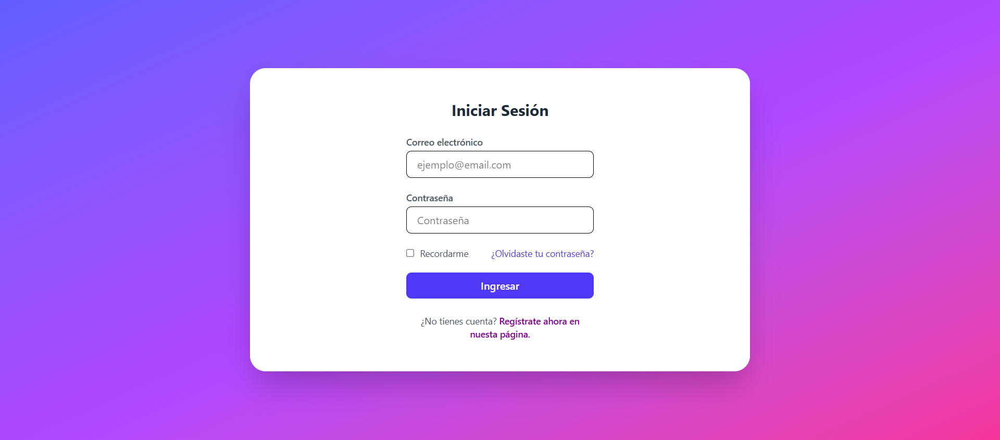

# Login con Tailwind

Descripción breve del proyecto.

## 🚀 Tecnologías
- HTML
- Tailwind
- Node.json

## 📸 Capturas

## 📦 Instalación
1. Clona el repositorio
2. Abre GIT
3. Escribe el comando npm install (npm i) para instalar las depencias
4. Luego, el comando: npm run dev
5. Abre index.html
6. y ¡listo!

